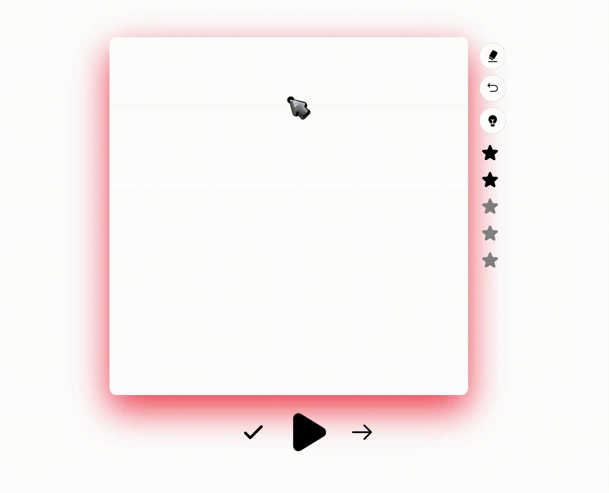

## Alphabet learnern

UI for comunication with my model on [huggingface](https://huggingface.co/spaces/PandaLikesPotato/panda_sandbox), that accepts [Base64](https://en.wikipedia.org/wiki/Base64) image of Georgian (for now) handwriting.

User can:
- play a pronunciation of a letter
- draw a letter
- get a hint about a current letter
- check if a user's answer is right and get grade
- send a feedback

